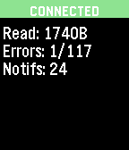

# smartstrap-library-test

> Note: This example will not build until SDK 3.4 is available.

This is a smartstrap example project with a simple UI that can be used to test
the connection of a developer's smartstrap. It displays connection status, bytes
read, error ratio (out of total messages) and the number of notifications
received.